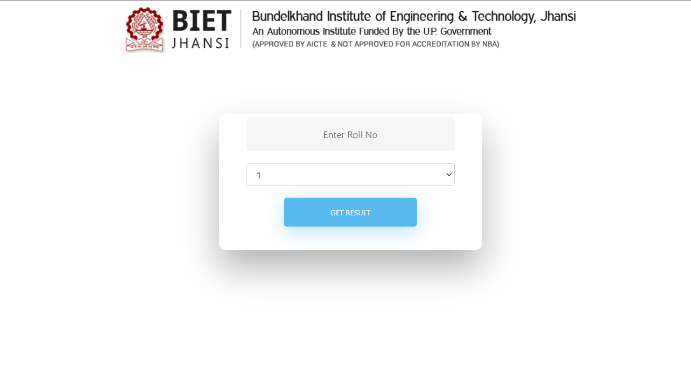

# Marks-Visualization-into-Excel-using-selenium


We are collecting result of 3rd semester b-tech(2019) from biet jhansi.([BIET RESULT](http://www.bietjhs.ac.in/result2019/GetResultodd.aspx))



<hr>

### Getting Roll No's from file 'IT-2nd xlsx'

To Get data from excel we will use 'pandas' library.

```python

import pandas as pd
data = pd.read_excel('IT-2nd.xlsx')
```


### Creating Workbook
Using 'xlwt' library we create a Excel workbook--

```python

from xlwt import Workbook 
wb = Workbook() 
sheet1 = wb.add_sheet('IT') 
sheet1.write(0, 0, 'ROLL NO') 
sheet1.write(0, 1, 'NAME') 
sheet1.write(0, 12, 'YGPA') 
sheet1.write(0, 13, 'TOTAL') 
sheet1.write(0, 14, 'PERCENTAGE') 

```
We will add remaining columns depending upon subjects.

### Launching Chrome

After this, we will launch chrome and open our required website.

```python

from selenium import webdriver
driver = webdriver.Chrome('F:\Applications\chromedriver.exe')
driver.set_window_size(1400,1000)
driver.get('http://www.bietjhs.ac.in/result2019/GetResultodd.aspx')
```

### Getting Marks and ygpa and writting back
We will be getting data from web-site with selenium library and write it back to Excel file. And save it

### Sorting result according to percentage
To sort the result we will again read the excel file using pandas and sort the result.
```python
import pandas
df = pd.read_excel('Marks.xlsx')
df = df.replace(np.nan, 0)
df = df.sort_values('PERCENTAGE', ascending = False)
```

Then we will delete old unsorted excel file
```python
import os
os.remove("Marks.xlsx")
```

Then we will save the new worksheet with sorted data
```python
from pandas import ExcelWriter
df.to_excel('Marks.xlsx', sheet_name  = 'IT',index=False, engine='xlsxwriter')  
```


> Project Idea Sarthak jain (github- [Sarthak Jain](https://github.com/Sarthak2608))
